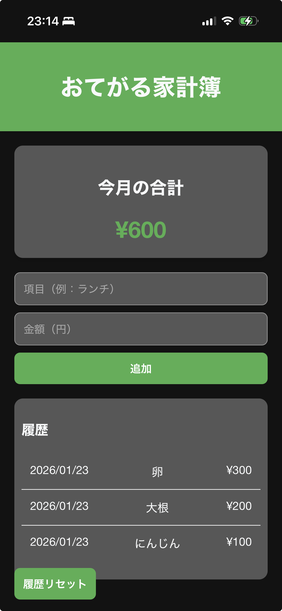

# おてがる家計簿
遊びの合間やスーパーの買い出しに。即座に記録、その場で合計がわかるミニマルな会計メモアプリ。

## サービス概要
外出先や買い物中に、支出の合計をリアルタイムで把握することに特化した家計簿アプリです。

- **ターゲット**: 
  - スーパーで買い物をする際に、カゴの中身の合計金額を簡単に把握したい方
  - 遊びに行く際に親からお小遣いをもらい、帰宅後に正確な収支報告が必要な学生
  - 複雑な家計簿アプリは続かないが、その場の支出だけはメモしておきたい方
- **課題**: 
  - 買い物中、予算内に収まっているか計算するのが面倒。
  - LINEのメモなどの自由記述ではフォーマットが定まらず、記録や集計に時間がかかる。
  - Excelなどは起動や入力の手間がかかり、レジ前や売り場では使いにくい。
- **解決策**: 
  - PWA（Progressive Web App）を採用。ホーム画面からネイティブアプリ感覚で爆速起動。
  - 「項目」と「金額」を入れるだけの最小限の操作。片手が塞がっている買い物中でもサクサク入力できます。

## 使用技術
### Frontend
- **HTML5 / CSS3**: 変数を用いたメンテナンス性の高いデザイン管理（ダークモード対応）。
- **JavaScript (Vanilla JS)**: 外部ライブラリに頼らない軽量な動作。
- **PWA技術**: 
  - Service Workerによるオフライン動作・キャッシュ管理。
  - Web App Manifestによる「ホーム画面に追加」対応。

### Infrastructure / Tools
- **LocalStorage**: ログイン不要で、データはすべてブラウザ内に安全に保存。
- **Git / GitHub**: バージョン管理。

## 主な機能
- **リアルタイム合計表示**: 入力するたびに合計が即座に更新されます。
- **爆速入力**: 自動で日付が付与されるため、ユーザーは金額を打つだけ。
- **オフライン対応**: スーパーの奥など電波の悪い場所でも、止まることなく記録が可能。
- **ダークモード対応**: 店内や夜道でも画面が眩しくないよう、OS設定に合わせて自動で配色が切り替わります。
- **履歴リセット**: 買い物が終わったらワンタップで履歴をクリアし、次の買い物に使用できます。

## こだわったポイント・工夫した点
- **「片手操作」を意識したUI**: 
  スーパーでの利用を想定し、片手でスマホを持ちながら親指だけで「入力→追加」ができるよう、要素の配置やサイズを調整しました。
- **入力摩擦の徹底排除**: 
  中学生、高校時代の友人が「メモを取るのに時間が取られていた」という原体験から、あえてカテゴリー分けなどの機能を削ぎ落とし、1秒でも早く記録を終えられる構成にこだわりました。
- **iOSでのユーザビリティ**: 
  iPhoneでの入力時にフォームが勝手にズームされないよう、フォントサイズを16pxに固定。現場での「使い心地」を最優先しています。

## スクリーンショット / デモ


## 開発環境のセットアップ
1. 本リポジトリをクローンします
   ```bash
   git clone https://github.com/mizunofukusayou/BudgetBook.git
   ```
2. ローカルサーバーを起動して確認します